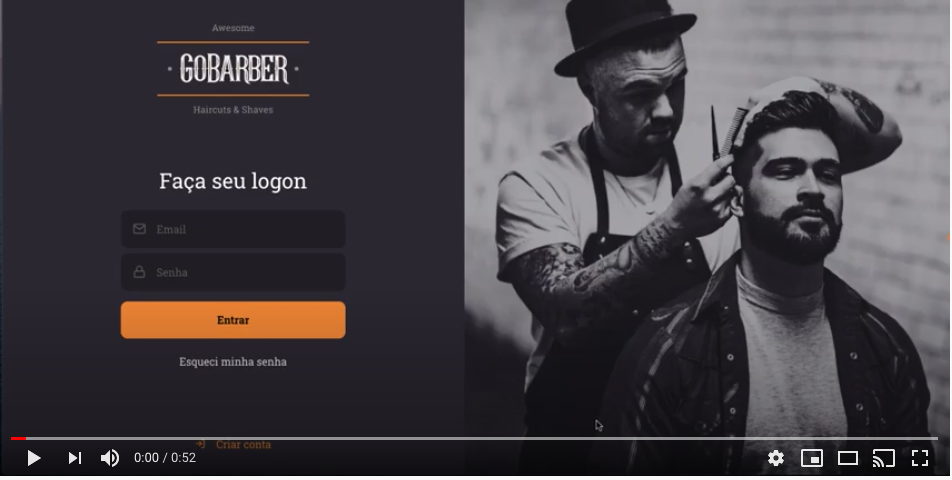

# GoBarber 

This is the web version to connect barbers and customers.

## Goal 

Project created to study ReactJS.

_ReactJS and typescript used_

Using concepts of hooks, props, animations with the react-spring library and styled-components.

## Preview

In this video you can see the animations, styles and authentications.

**_Video_**

**This page is still under construction** :construction_worker:

made by :two_hearts: _Pri Pinheiro_